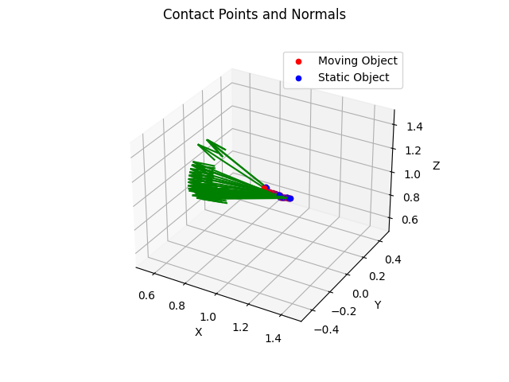

# 498 Project

## Collecting collision data
### **Moving-fixed, static-free**
For collecting collision data from pybullet, use the script `pybullet_experiments/urdf_collision.py`
Running this will start generating `npz` files in `log/data`.

This script will generate data such that the moving object follows a fixed trajectory. No force is applied to this object, meaning that upon collision, the moving object will continue it's pre-set traajectory, while the static object will experience some applied force/impulse and accordingly displace itself.

This will follow some assumption that:
- The "moving object" is the robot arm, which does not experience a force applied by the "static object"
- The static object is a "free" object.

#### **File naming:**
`{moving_object_name}_{static_object_name}_{number}.npz`

#### **File content**
```
np.savez(file=filename[:-4],
             simulation_time=simulation_time,
             moving_position=moving_position,
             moving_orientation=moving_orientation,
             moving_velocity=moving_velocity,
             moving_angular_velocity=moving_angular_velocity,
             static_position=static_position,
             static_orientation=static_orientation,
             static_velocity=static_velocity,
             static_angular_velocity=static_angular_velocity,
             contact_points_moving=contact_points_moving,
             contact_points_static=contact_points_static,
             contact_normal=contact_normal,
             contact_normal_force=contact_normal_force,
             contact_times=contact_times,
             lateral_friction_force1=lateral_friction_force1,
             lateral_friction_force2=lateral_friction_force2,
             lateral_friction_dir1=lateral_friction_dir1,
             lateral_friction_dir2=lateral_friction_dir2,
             moving_mass=moving_mass,
             moving_inertia=moving_inertia,
             moving_friction=moving_friction,
             static_mass=static_mass,
             static_inertia=static_inertia,
             static_friction=static_friction,
             allow_pickle=True)
``` 

Contact points is structured as a tuple of tuples. Each one of the "sub"-tuples has:
```
0: contactFlag
1: body1 ID
2: body2 ID
3: link1 index
4: link2 index
5: 3-tuple of the position of contact on the frame of body1
6: 3-tuple of the position of contact on the frame of body2
7: The normal direction of the contact, relative to the local coordinate system of the second object, as a tuple of three floats. (Need to double check this)
8: ??
9: normalForce (N?)
10: lateralFriction for body1
11: 3-tuple lateralFriction direction for body1
12: lateralFriction on body2
13: 3-tuple lateralFriction direction for body2
```
Number of "sub"-tuples is dictated by the number of contact points at the time.

An example of the normals can be found in 

### **Moving-free, static-free**

#### **Running the script**
Run `python3 linear_collision.py`

For this script, two objetcts are placed at an arbitrary, random two positions, and a force is applied to one in the direction of the other at a random magnitude. 
Both objects are "free" in the sense that if the force of the push isn't strong enough, collision may not occur.

This is a more realistic scenario for two "free" objects.


**FOR BOTH SCRIPTS, GRAVITY IS TURNED OFF**

**TODO:**
- Maybe on a tabletop? Turn on gravity and apply a force?
